# Synthetic Metropolis Homography Dataset for Multiple Homography Fitting
<p float="left">
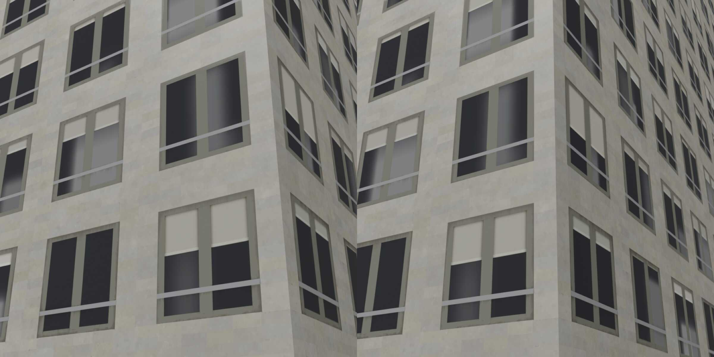
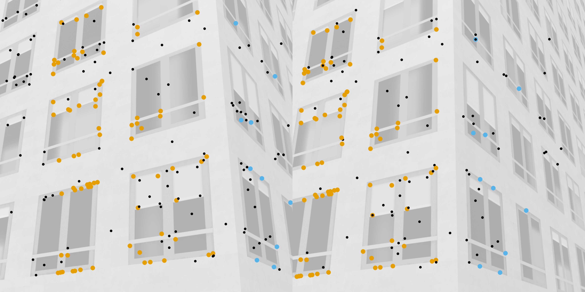
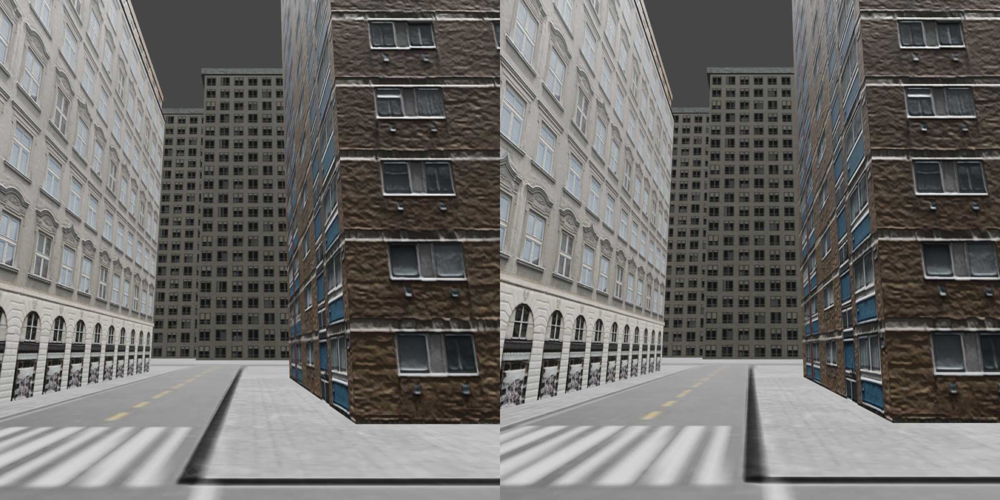
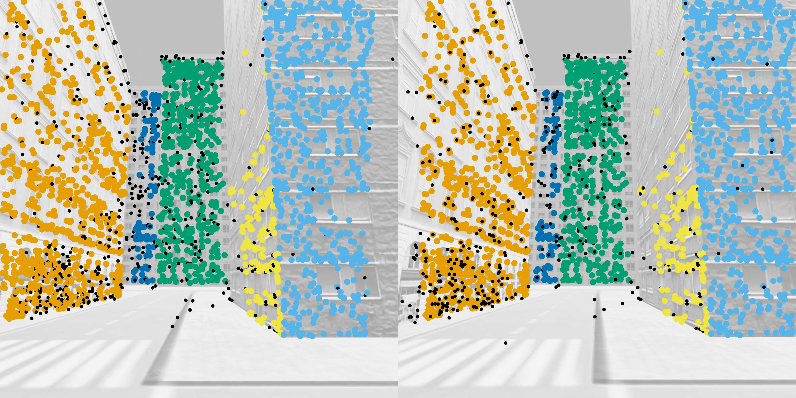   
</p>
<p float="left">
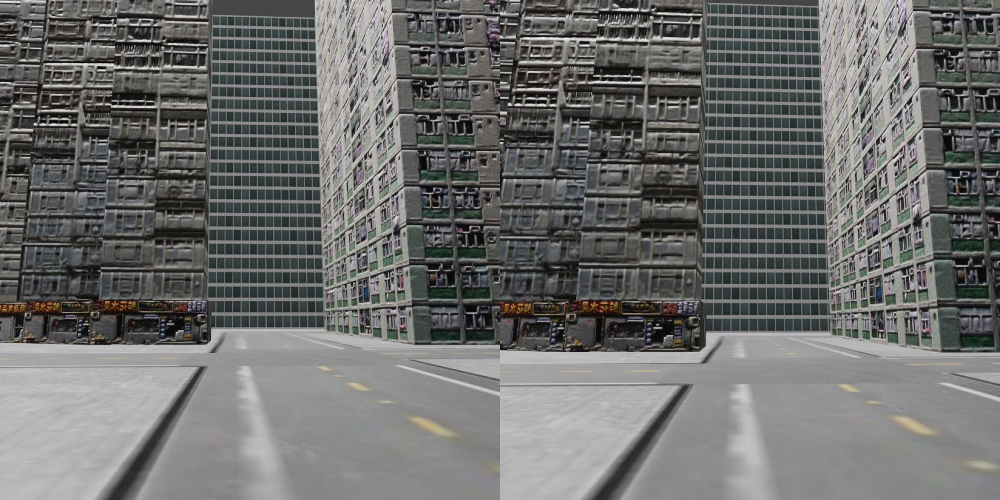
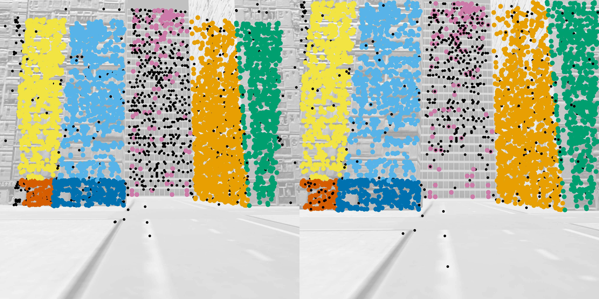   
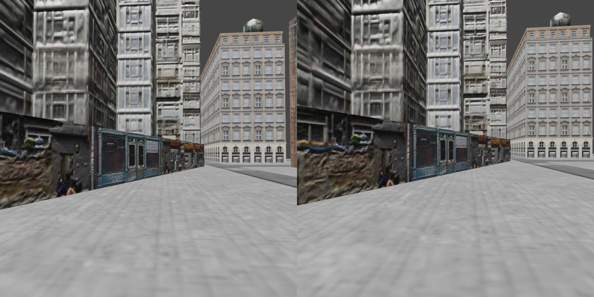
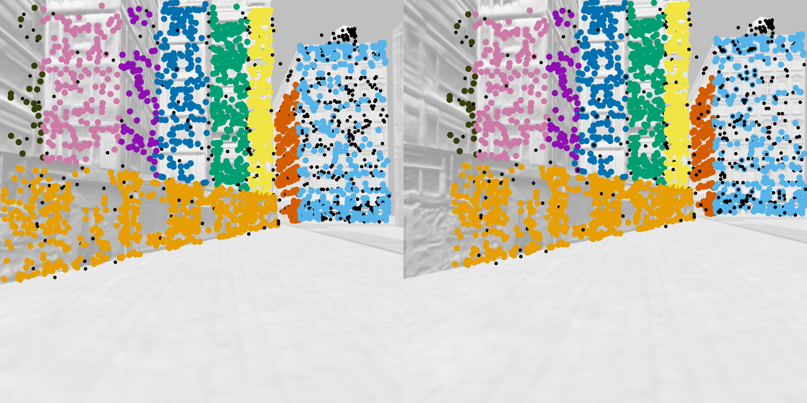   
</p>
<p float="left">
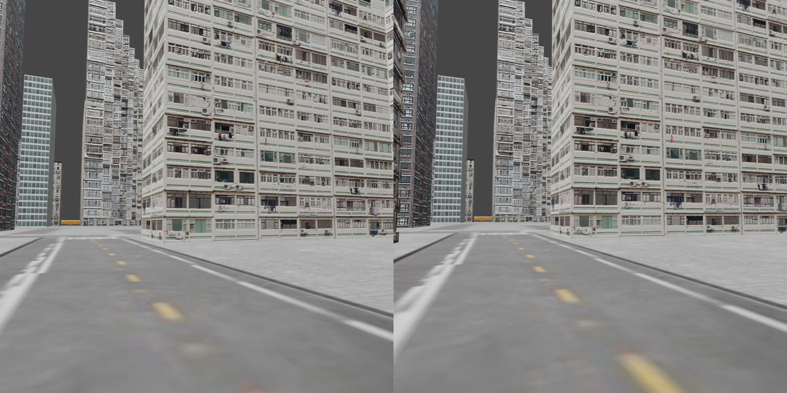
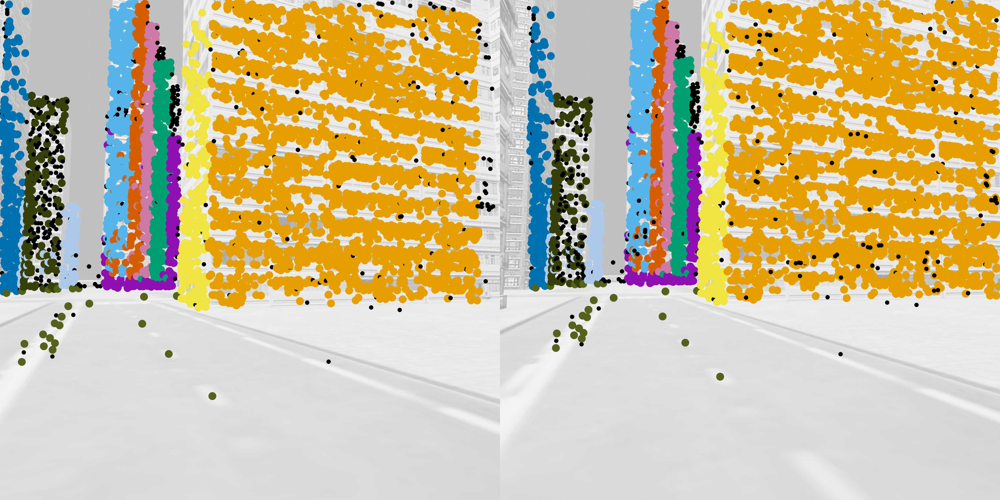   
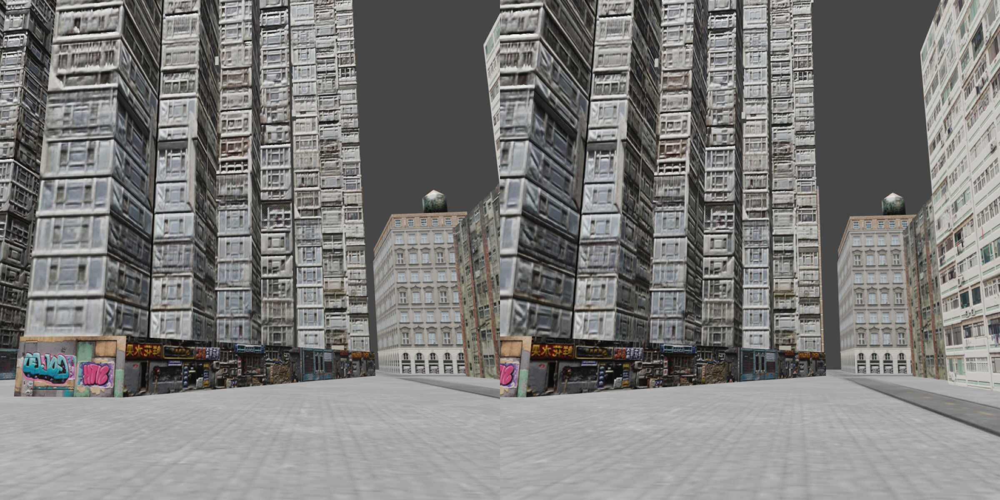
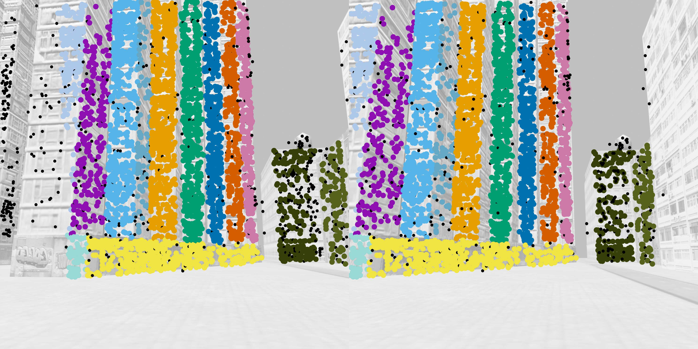   
</p>

Synthetic Metropolis Homographies (SMH) contains 48002 synthetically generated image pairs showing s synthetic city environment.
It is based on the ["City" 3D model by Mateusz Woliński](https://sketchfab.com/3d-models/city-1f50f0d6ec5a493d8e91d7db1106b324).
Please note that the author does not allow their 3D model to be used in datasets for, in the development of, or as inputs to generative AI programs.

Each pair shows between one and 32 independent planes.
We provide ground truth homographies for each plane, as well as pre-computed SIFT features with ground truth cluster labels.

For more details about this dataset, please refer to our paper:  
[PARSAC: Accelerating Robust Multi-Model Fitting with Parallel Sample Consensus](arxiv.org)

If you use this dataset in a publication, please cite our paper:
```
@inproceedings{kluger2024parsac,
  title={PARSAC: Accelerating Robust Multi-Model Fitting with Parallel Sample Consensus},
  author={Kluger, Florian and Rosenhahn, Bodo},
  booktitle={Proceedings of the AAAI Conference on Artificial Intelligence},
  year={2024}
}
```

## Download

### Features and ground truth, no images (~2.7 GB)
https://cloud.tnt.uni-hannover.de/index.php/s/oRLcR4a6dJR3qEb

### Full dataset with RGB images and depth maps (~133 GB) 
https://cloud.tnt.uni-hannover.de/index.php/s/Xk65REnGWm9Witm

## Data structure
The dataset is split into seven directories, each containing image pairs from a *coarse* camera trajectory.
These are long, uninterrupted camera trajectories which do not connect to each other.
Each coarse trajectory consists of multiple *fine* trajectories which are connected to each other and are stored in separate subdirectories.
Finally, there are multiple directories within each fine trajectory containing all the actual image pairs:
```
├── 0/
│   ├── 00/
│   │   ├── 0000
│   │   ├── 0001
│   │   ├── ...
│   │   └── 0407
│   ├── 01/
│   │   ├── 0000
│   │   ├── ...
│   │   └── 0233
│   ├── ...
│   └── 29/
│       └── ...
├── 1/
│   └── ...
├── ...
└── 6/
    └── ...
```

In each sub(sub)directory, you can find the rendered images (if downloaded), pre-computed SIFT features and ground truth information. For example:
```
└── 2/
    └── 13/
        └── 0045/
            ├── camera0.npz
            ├── camera1.npz
            ├── depth0.png
            ├── depth1.png
            ├── features_and_ground_truth.npz
            ├── render0.png
            └── render1.png
```
* `features_and_ground_truth.npz`: Contains SIFT features (`points1`, `points2` and `ratios`), intrinsic camera parameters (`K1`, `K2`), relative camera pose (`R`,`t`), plane parameters in normal form (`planes`) and cluster labels for the SIFT features (`labels`).
* `depth0.png` and `depth1.png`: ground truth depth maps (stored as uint16 PNG; depth values cover a range of 0-1000 metres)
* `render0.png` and `render1.png`: RGB image pair
* `camera0.npz` and `camera1.npz`: intrinsic and extrinsic camera parameters

The ground truth homographies can be computed from the provided camera and plane parameters:
$\mathbf{H} = \mathbf{K}_2 \left( \mathbf{R} - \frac{1}{d} \mathbf{t} \mathbf{n}^T \right) \mathbf{K}_1^{-1}$. 

## Dataset generation
### Features and ground truth
We computed the SIFT features and ground truth with the script ```prepare_features_and_gt.py```. 
If you want to re-compute them, you can download our original rendered images with the required metadata [here](https://cloud.tnt.uni-hannover.de/index.php/s/eHXe7trFzk7MCK8).
Caution: it is *very* slow.

### Rendering
We rendered the images with Blender 3.4.1, using the script `blender_render.py` and the Blender Python API. 
You can download the mesh [here](https://cloud.tnt.uni-hannover.de/index.php/s/yN8Rao3fYN772Kd). 
Since camera movement is randomised on the fly in the rendering script, the resulting images will be different from ours.

## License
Dataset: [CC BY 4.0](https://creativecommons.org/licenses/by/4.0)  
Source code: [BSD License](LICENSE)